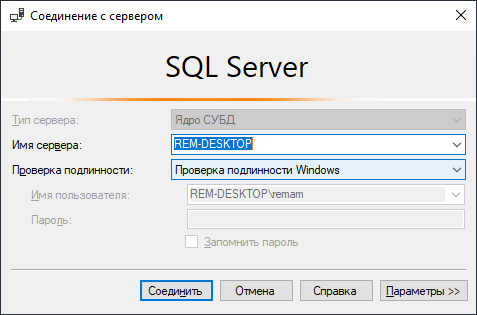

## Знакомство с MS SQL Server. Создание и заполнение таблиц


[все лекции](https://github.com/goryachkinama/db-practice/README.md)

---

### Как работает интернет


[Подробнее](https://developer.mozilla.org/ru/docs/Learn/Server-side/First_steps/Client-Server_overview)
---

### Microsoft SQL Server
* Одна из наиболее популярных систем управления базами данных в мире
* Создатель: Microsoft
* Первая версия вышла в 1987 году под Windows
* Начиная с версии #16 система доступна и на Linux (и на Mac, с помощью Docker)
* Текущая версия: ?
* Реляционная модель организации баз данных
---

### Язык SQL

* Разработчик: IBM
* Стандартизован в 1989 году
* Разновидности:
* * PL/SQL (для Oracle Database, но поддерживается также в DB2 и Timesten), 
* * PSQL (Interbase и Firebird) 
* * SQL PL (DB2), 
* * Transact-SQL (Microsoft SQL Server и Adaptive Server Enterprise)
* * PL/pgSQL (PostgreSQL)

```sql
SELECT ProductName,
       Manufacturer,
       Price,
       (SELECT AVG(Price) FROM Products AS SubProds
        WHERE SubProds.Manufacturer=Prods.Manufacturer)  AS AvgPrice
FROM Products AS Prods
WHERE Price >
      (SELECT AVG(Price) FROM Products AS SubProds
       WHERE SubProds.Manufacturer=Prods.Manufacturer)
```

---

### Подмножества языка SQL
* DDL (Data Definition Language / Язык определения данных): создание баз данных, таблиц, индексов, хранимых процедур и т.д.
* * CREATE: создает объекты базы данных (саму базу даных, таблицы, индексы и т.д.)
* * ALTER: изменяет объекты базы данных
* * DROP: удаляет объекты базы данных
* * TRUNCATE: удаляет все данные из таблиц
* DML (Data Manipulation Language / Язык манипуляции данными): выбор данных, их обновление, добавление, удаление - т.е. управление данными.
* * SELECT: извлекает данные из БД
* * UPDATE: обновляет данные
* * INSERT: добавляет новые данные
* * DELETE: удаляет данные
* DCL (Data Control Language / Язык управления доступа к данным). К этому типу относят команды, которые управляют правами по доступу к данным. В частности, это следующие команды:
* * GRANT: предоставляет права для доступа к данным
* * REVOKE: отзывает права на доступ к данным
---

### SQL Server Management Studio
* 
---